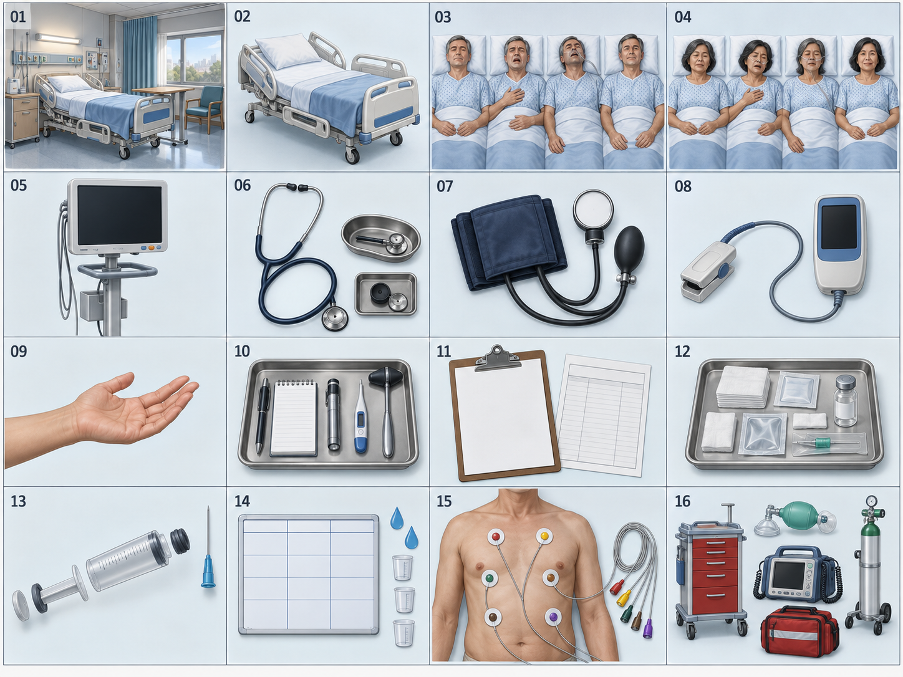

# CardioSim — บรีฟภาพเกมสำหรับทีมเวชนิทัศน์



ภาพนี้เป็น visual reference รวมประเภทของ asset ไม่ใช่รายการสั่งวาดแบบตายตัว: UI tray, clipboard/form, ECG tray และอุปกรณ์ฉุกเฉินบางชิ้นในภาพเป็นเพียงภาพประกอบแนวคิด ให้ยึดรายการผลิตและขอบเขตงานด้านล่างเป็นหลัก

## จุดประสงค์

เอกสารนี้ใช้ส่งต่อทีมเวชนิทัศน์เพื่อผลิต **ภาพประกอบชุดจริงของเกม CardioSim** ภาพที่อยู่ใน demo ปัจจุบันเป็นเพียงต้นแบบสำหรับทดลองระบบ ตำแหน่ง และขนาดการแสดงผล ให้ใช้เป็นตัวอย่างการใช้งานเท่านั้น ไม่ถือเป็นภาพสุดท้ายหรือข้อกำหนดให้ลอกตาม ไฟล์สเปกที่แนบมากับคำขอใช้เป็นตัวอย่างด้านความละเอียดและรูปแบบเอกสารเท่านั้น รายละเอียดทางคลินิกในไฟล์แนบ เช่น ค่าวินิจฉัย ยา/ขนาดยา อาการวิกฤต อุปกรณ์ invasive หรือชิ้นงานนอก storyboard **ไม่ถือเป็น requirement ของ CardioSim** เว้นแต่ทีมโครงการและผู้เชี่ยวชาญจะยืนยันแยกต่างหาก

ขอบเขตภาพอิงสตอรี่บอร์ด CardioSim หน้า 3–7 ตั้งแต่รับช่วงดูแลผู้ป่วย ตรวจร่างกาย วินิจฉัย วางแผนการพยาบาล เตรียมยา บันทึก I/O เข้าสู่ภาวะฉุกเฉิน ประเมิน ABC ติด ECG ตอบสนอง และดูผลภารกิจ ฉากและอุปกรณ์ต้องรองรับการเล่นในห้องผู้ป่วยฉากเดิมตลอดเกม

สิ่งที่ต้องส่งในรอบนี้คือ **ไฟล์ต้นฉบับที่แก้ไขได้และแยก layer** เป็น PSD หรือ KRA อย่างใดอย่างหนึ่งก็ได้ ไม่ต้อง export PNG/WebP ส่งมา ทีมพัฒนาจะเป็นผู้ export และปรับขนาดสำหรับ Phaser หลังยืนยันตำแหน่งกับขนาดจริง ไม่รับเฉพาะภาพตัวอย่างหรือ mood board แทน source file

## ภาพรวมทิศทางศิลป์

- เกม 2D แบบภาพวาดดิจิทัลกึ่งสมจริง อ่านวัตถุได้ทันทีบนจอเล็ก ให้บรรยากาศห้องดูแลผู้ป่วยที่จริงจังและเป็นมิตร ไม่ใช้เลือดหรือภาพรุนแรง
- กำหนดมุมกล้อง แสง ทิศเงา สัดส่วนคนไข้ เตียง และอุปกรณ์ให้ตรงกันทั้งชุด ภาพห้องต้องดูเป็นสถานที่เดียวกันในทุก Mission
- ผู้ป่วยและเครื่องมือเป็นจุดเด่น ฉากหลังมีรายละเอียดพอให้เชื่อว่าเป็นห้องจริง แต่ต้องไม่แย่งสายตาจากจุดที่ผู้เล่นกำลังตรวจ
- ออกแบบภาพต้นฉบับของ CardioSim ไม่เลียนแบบตัวละคร ไอคอน หน้าจอ สีประจำแบรนด์ หรือองค์ประกอบเฉพาะของเกมอื่น
- เผื่อ safe area สำหรับ HUD และจอมือถือแนวตั้ง ภาพสำคัญ เช่น ใบหน้า มือ จุดวางเครื่องมือ และ ECG target ต้องไม่ถูกครอป
- ใช้สีและแสงช่วยแยกสถานะปกติ อาการทรุด และการฟื้น แต่ห้ามใช้สีแทนข้อความหรือสัญญาณอื่นเพียงอย่างเดียว

## รายการภาพที่ต้องวาดใหม่

ตารางนี้ครอบคลุมภาพวาดที่ขอจากทีมเวชนิทัศน์ ภาพ UI เช่น ปุ่ม กรอบการ์ด และแผงภารกิจจะทำโดยทีมพัฒนา จึงไม่รวมเป็นภาระวาดของทีมเวชนิทัศน์

| กลุ่ม | สิ่งที่ต้องวาด | รายละเอียดการใช้งานและสถานะ |
|---|---|---|
| ห้องผู้ป่วย | ฉากห้องหลักแบบแยกชั้น | ผนัง พื้น หน้าต่าง/ม่าน แสงห้อง และรายละเอียดฉากหลังเป็นชั้นแยก; ทำฉากกว้างสำหรับ desktop และจัดองค์ประกอบให้ครอปแนวตั้งได้โดยไม่ตัดผู้ป่วย |
| เตียง | เตียงผู้ป่วยและชิ้นส่วนแยก | โครงเตียง ฟูก หมอน ผ้าห่ม ราวเตียง และล้อ; แยกส่วนที่ต้องขยับได้ เช่น พนักพิงหรือส่วนปรับเตียง เพื่อให้เกมแสดงการจัดท่าได้ |
| อุปกรณ์ประจำห้อง | โต๊ะ/ชั้นข้างเตียงและอุปกรณ์บนผนังตาม storyboard | วาดเฉพาะของที่จำเป็นต่อฉากและการเล่น เช่น จุดแขวน/วางอุปกรณ์; สาย อุปกรณ์เสริม หรือป้ายที่มีผลทางคลินิกต้องอิงรายการที่ทีมโครงการยืนยัน |
| ผู้ป่วย Case 1 | ตัวละครผู้ป่วยเต็มตัวบนเตียง | ข้อมูล demo ใน `case1Data.ts` ระบุผู้หญิงอายุ 39 ปีและยังรอตรวจรับรอง; วาดให้เข้ากับมุมเตียงและฉาก แยกชั้นลำตัว ศีรษะ แขน มือ ผ้าห่ม และจุดยึดสำหรับ animation; โครงการต้องยืนยันรูปลักษณ์ก่อน final ห้ามอนุมานเพิ่มจากชื่อโรค |
| ผู้ป่วย Case 2 | ตัวละครผู้ป่วยเต็มตัวบนเตียงอีกคน | ตามเรื่องย่อปัจจุบันระบุหญิงไทยอายุ 65 ปี; ให้ทีมโครงการยืนยันรายละเอียดภาพก่อนล็อกแบบ และใช้สเกล/มุม/ตำแหน่งบนเตียงเดียวกับ Case 1 |
| ท่าทางผู้ป่วย | ชุดภาพ/ชั้น animation ตาม state ที่แต่ละ Case ใช้จริง | Case 1 เตรียมอย่างน้อย: idle/assessment, labored, critical, recovering; Case 2 ทำเฉพาะ state ที่มีข้อมูลรองรับใน config ห้ามสมมติว่าต้องมี crisis/recovery เหมือน Case 1; แยกหน้า/อก/ไหล่สำหรับ loop หายใจโดยไม่ให้สัดส่วนกระโดด |
| เครื่องวัดสัญญาณชีพ | ไม่ต้องวาดจอ Patient Monitor ในรอบนี้ | จอ ค่า HR/BP/RR/SpO₂ คลื่น ECG และ alarm เป็น React UI ของเกม; อุปกรณ์ในฉากวาดเพิ่มเฉพาะเมื่อทีมพัฒนายืนยันตำแหน่งและนำเข้า Phaser จริง |
| เครื่องมือซักประวัติ | ไม่ต้องวาดเป็นอุปกรณ์แยก | เป็นการโต้ตอบด้วย UI และข้อความบทสนทนา ทีมพัฒนาทำไอคอน/ข้อความเอง |
| Stethoscope | ภาพอุปกรณ์ตัดพื้นหลัง | แยกสาย หูฟัง และหัว diaphragm ในเลเยอร์; เตรียม anchor ที่หัวฟังเพื่อวางบนทรวงอก โดยไฟล์เดียวใช้ทั้งถาด/ตอนถือ/ตอนตรวจ |
| BP cuff | cuff, สาย และมาตรวัดแบบไม่มีค่า | แยก cuff/สาย/มาตรวัด; ไม่ต้องวาดแขนผู้ป่วยติดมาด้วย และไม่ใส่ค่าความดันบนหน้าปัด |
| SpO₂ sensor | finger clip, สาย และตัวอ่านแบบจอว่าง | แยกปาก clip/สาย/ตัวอ่าน; ไม่ฝังตัวเลขหรือหน่วย |
| มือสำหรับประเมิน ABC | ภาพมือ/แขนเสื้อสั้นเป็น sprite | เป็นภาพตัวช่วยตอนมือเข้าจุดสัมผัสเท่านั้น; ท่าทางและตำแหน่งต้องให้ผู้เชี่ยวชาญตรวจ ไม่มีการแสดงหัตถการที่ไม่ได้อยู่ในกิจกรรม |
| Ampoule / vial | หลอดหรือขวดยาเปล่าฉลาก | label ต้องว่างและแยกชิ้นจากภาชนะ; ห้ามใส่ชื่อยา ความเข้มข้น สีรหัส หรือปริมาตร |
| Syringe minigame | กระบอกฉีดยาแยกชิ้น | แยก barrel, plunger rod, thumb pad, stopper, tip/hub และ needle; เผื่อ pivot ให้ลาก plunger ตามแนวแกนได้; ตัวเลขสเกล/หน่วยให้ทีมพัฒนาวาดจาก config |
| อุปกรณ์เตรียมยา | ชิ้นอุปกรณ์ที่มีการใช้งานจริงในขั้นที่กำหนด | วาดเฉพาะ vial, syringe, อุปกรณ์ปลอดเชื้อ, wristband หรืออุปกรณ์อื่นที่ทีมพัฒนายืนยันว่าจะให้ผู้เล่นหยิบ/ลาก; ไม่วาดถาด/แบบฟอร์มเป็นภาพพื้นหลัง UI |
| โทเคน I/O | ภาพชิ้นลากแทนรายการจาก Case 1 demo | ต้องมีชิ้น IV intake, oral intake และ urine output แบบไม่ติดข้อความ/ปริมาตร; ทีมพัฒนาวาดบอร์ด ช่องวาง และตัวเลขเอง |
| ผังทรวงอก ECG | ภาพ torso map เปล่าแยกจากผู้ป่วยบนเตียง | มี front orientation และพื้นที่วาง electrode; ต้องรอผู้เชี่ยวชาญส่ง/ตรวจตำแหน่ง V1–V6 ก่อนล็อกภาพ; ห้ามวาดจุดเฉลยเอง |
| ECG leads V1–V6 | electrode pad และสาย 6 ชิ้นแยก | แต่ละชิ้นต้องลากได้และมีขอบ/สีที่แยกกันชัด; ชื่อ V1–V6 ทำเป็น text แยกโดยทีมพัฒนา ไม่ฝังลงภาพ |
| Emergency equipment | ยังไม่มีชิ้นภาพฉุกเฉินที่ยืนยันให้วาดในรอบนี้ | patient state, alarm, vital transition และคำตอบ Treatment แสดงด้วยภาพผู้ป่วย/โค้ด; ถ้ามีอุปกรณ์เป็นภาพโต้ตอบจริง จะเพิ่มเป็นรายการแยกหลังยืนยัน storyboard/config และผู้เชี่ยวชาญ |

## สเปกผลิตรายชิ้น

ขนาดด้านล่างเป็น **ขนาด source ที่แนะนำสำหรับเริ่มวาด** โดยคูณประมาณ 2 เท่าจากขนาดที่เกมแสดงใน Phaser เพื่อให้ย่อบนจอได้คมชัด ขนาดและจุดยึดสุดท้ายจะล็อกหลังนำภาพร่างมาทดลองในฉากจริง ทีมวาดไม่ต้องจัดตำแหน่ง hotspot หรือเดาตำแหน่งทางคลินิกเอง

### A. ฉากห้องและเตียง

| ID / ไฟล์ต้นฉบับ | อาร์ตบอร์ดแนะนำ | ชั้นที่ต้องแยกใน PSD/KRA | จุดประสงค์และข้อกำหนด |
|---|---:|---|---|
| `room_background.kra` | 3000 × 2200 px, RGB, opaque | `BG_WALL`, `BG_FLOOR`, `WINDOW`, `CURTAIN`, `WALL_FIXTURES`, `LIGHTING`, `SHADOWS` | ฉากห้องหลักที่ต่อเนื่องรอบเตียงและเผื่อ crop แนวตั้ง/แนวนอน พื้นที่หลังศีรษะและทรวงอกผู้ป่วยต้องไม่แน่นด้วยรายละเอียด ห้ามวาดข้อความบนอุปกรณ์หรือป้ายที่เกมต้องแสดงตาม state |
| `bed_layers.kra` | 3000 × 2200 px, transparent | `BED_FRAME`, `MATTRESS`, `RAILS`, `PILLOW`, `SHEET`, `BLANKET`, `ADJUSTABLE_BACK` | ใช้ canvas เดียวกับฉากห้องทุกพิกเซล เพื่อซ้อนทับได้ตรง เตียงและส่วนปรับพนักพิงแยกกัน แต่ไม่ต้องทำเฟรม animation หากยังไม่มี interaction ปรับเตียงจริง |
| `room_props.kra` | 3000 × 2200 px, transparent และตรงกับฉาก | แยกพร็อพที่ต้องขยับ/เปิดได้เป็น layer; พร็อพคงที่อยู่ใน `room_background.kra` | ส่งเฉพาะพร็อพที่ทีมพัฒนายืนยันว่าจะนำเข้าฉากจริง ถ้าเป็นเพียงของตกแต่งให้รวมกับฉากพื้นหลังได้ ไม่ต้องวาด monitor casing เพราะจอ Patient Monitor ปัจจุบันเป็น UI ที่ทีมพัฒนาวาด |

ตัวเลข 3000 × 2200 อิงภาพห้องที่เกมปัจจุบันแสดงประมาณ 1500 × 1100 CSS/world pixels เพื่อให้ได้ source 2× ไม่ใช่ข้อกำหนดให้คงสัดส่วน prototype หากทีมพัฒนาล็อกขนาดห้องใหม่ จะส่ง artboard ที่ยืนยันแล้วให้ก่อนทำ clean final

### B. ผู้ป่วย Case 1 และ Case 2

| ID / ไฟล์ต้นฉบับ | อาร์ตบอร์ดแนะนำ | ชั้น/กลุ่มที่ต้องแยก | จุดประสงค์และข้อกำหนด |
|---|---:|---|---|
| `patient_case01.kra` | 584 × 876 px, transparent | `HEAD_FACE`, `TORSO`, `ARM_L`, `ARM_R`, `HAND_L`, `HAND_R`, `GOWN`, `BLANKET_EDGE`, `BREATH_CHEST`, `BREATH_SHOULDER` | ผู้ป่วยเต็มตัวตามภาพที่เห็นในฉากปัจจุบัน จัด pose ให้เข้ากับเตียงและเหลือจุดเข้าถึงศีรษะ ทรวงอก ต้นแขน ข้อมือ และนิ้ว ใช้รายละเอียดอายุ/เพศจากข้อมูลโครงการที่ยืนยันแล้วเท่านั้น |
| `patient_case02.kra` | 584 × 876 px, transparent | ใช้ชื่อ layer และตำแหน่งเดียวกับ Case 1 | ผู้ป่วยอีกคนสำหรับ Case 2; เรื่องย่อปัจจุบันระบุหญิงไทยอายุ 65 ปี แต่รายละเอียดใบหน้า รูปร่าง สีผิว และเครื่องแต่งกายให้ทีมโครงการยืนยันก่อนลงรายละเอียด |
| `patient_case01_states.kra` | 584 × 876 px ต่อ state บน canvas เดียวกัน | `IDLE`, `LABORED`, `CRITICAL`, `RECOVERING` แยก group; ภายในแยกหน้า อก ไหล่ แขน หากท่าทางเปลี่ยนให้ส่งทั้ง layer และภาพรวมที่จัดตำแหน่งแล้ว | ต้องวางสลับ state แล้วตัวผู้ป่วยไม่กระโดดตำแหน่ง ภาพ critical สื่อความรุนแรงด้วยสีหน้า/ท่าทางตามข้อมูลที่อนุมัติ ไม่เติมอุปกรณ์หรืออาการใหม่เอง |
| `patient_case02_states.kra` | 584 × 876 px ต่อ state บน canvas เดียวกัน | ใช้ชุด state และชื่อ layer เดียวกับ Case 1 | ทำเฉพาะ state ที่ Case 2 ใช้จริงใน config หากไม่มี clinical event รองรับ ให้ใช้ idle/assessment และไม่วาดภาพวิกฤตเพิ่ม |

เกมปัจจุบันแสดงผู้ป่วยราว 292 × 438 pixels และสลับภาพปกติกับภาพ critical ที่ตำแหน่งเดียวกัน ดังนั้นทุก state ต้องใช้ **canvas 584 × 876 เดียวกัน, registration/pivot เดียวกัน, scale เดียวกัน** พื้นหลังต้องโปร่งใส ขอบ alpha สะอาด และเผื่อ silhouette เสื้อผ้า/ผ้าห่ม ไม่ส่งร่างกายเปลือยหรือ overlay อวัยวะภายใน เว้นแต่ทีมโครงการเปิด scope และผู้เชี่ยวชาญอนุมัติเป็นลายลักษณ์อักษร

รายละเอียดที่ต้องให้ทีมโครงการยืนยันก่อนทำ final: อายุ/เพศที่ใช้แสดง, ท่าเริ่มต้น, การเปิดบริเวณตรวจ, เสื้อผ้า/ผ้าห่ม, สีหน้าแต่ละ state, ภาษากายขณะหายใจลำบาก และขอบเขตการแสดงอุปกรณ์บนตัวผู้ป่วย ข้อมูล Case 1 เป็น demo รอตรวจรับรอง; Case 2 มีข้อมูลเพียงเรื่องย่อ

### C. เครื่องมือประเมินที่ผู้เล่นหยิบและลาก

ส่งเป็นชิ้นภาพโปร่งใสแยกไฟล์หรือแยก layer ภายใน KRA/PSD; ให้ชิ้นเครื่องมืออยู่กลาง canvas และมีพื้นที่รอบวัตถุพอสำหรับเงา/การหมุน ห้ามรวมมือผู้ป่วยหรือ hotspot เข้าไปในไฟล์เครื่องมือ

| ID / ไฟล์ต้นฉบับ | อาร์ตบอร์ดแนะนำ | layer/components | จุดยึดที่ต้องระบุ |
|---|---:|---|---|
| `tool_stethoscope.kra` | 512 × 512 px | `EARPIECES`, `TUBE`, `CHEST_PIECE`, เงาแยกได้ | `grab`: จุดจับสาย/ก้าน, `contact`: กึ่งกลาง diaphragm ที่แตะหน้าอก |
| `tool_bp_cuff.kra` | 512 × 512 px | `CUFF`, `TUBE`, `BULB_OR_CONNECTOR`, `GAUGE_BLANK` | `grab`: กลาง cuff, `contact`: กลางแถบ cuff; หน้าปัดไม่มีตัวเลข/หน่วย/เข็มค่าที่สื่อผล |
| `tool_spo2.kra` | 512 × 512 px | `FINGER_CLIP_TOP`, `FINGER_CLIP_BOTTOM`, `CABLE`, `DISPLAY_BLANK` | `grab`: จุดจับตัว clip, `contact`: ตำแหน่งปลายนิ้วที่สอดเข้า clip; จอว่าง |
| `tool_abc_hand.kra` | 512 × 512 px | `HAND`, `SLEEVE`, เงาแยกได้ | `grab`: กลางฝ่ามือ/ตำแหน่งจับ, `contact`: ปลายนิ้วหรือจุดที่ทีมโครงการระบุหลังตรวจท่าทาง |

อ้างอิงขนาดที่เกมแสดงตอนถือ/แตะใน config ปัจจุบัน: Stethoscope 68×68 / 56×56 px, BP cuff 72×64 / 64×56 px, SpO₂ 58×58 / 46×46 px (ตามลำดับ held/contact) ค่าเหล่านี้ใช้ประเมินความละเอียดเท่านั้น ภาพอาจเอียงและย่อไม่เท่ากันตามรูปทรงจริง ตำแหน่ง hotspot ปัจจุบันเป็นจุดกดของระบบเพื่อทดสอบ ไม่ใช่ anatomical landmark ที่รับรอง ผู้พัฒนาจะปรับจุด hit test หลังได้รับ art final

ไม่ต้องวาดถาดเครื่องมือ, วง hotspot, ป้ายชื่อ, tutorial hand animation, วง snap หรือ progress ring; ทีมพัฒนาทำส่วนเหล่านี้ในโค้ด

### D. อุปกรณ์สถานีเตรียมยาและ Syringe

กิจกรรมมีการฝึกดึง plunger จริงบนจอ จึงต้องแยกชิ้นที่ขยับได้ แต่ห้ามทำชื่อยา ความแรง ปริมาตรเป้าหมาย หรือปริมาณยาลงในภาพ

| ID / ไฟล์ต้นฉบับ | อาร์ตบอร์ดแนะนำ | layer/components | จุดยึด/การเคลื่อนไหว |
|---|---:|---|---|
| `syringe_body.kra` | 1024 × 512 px, transparent | `BARREL`, `TIP`, `FINGER_FLANGE`, `SCALE_BLANK`, `NEEDLE_OR_CAP` แยกตามที่ใช้จริง | กำหนด `syringe_origin`, `needle_tip`, `barrel_axis_start`, `barrel_axis_end`; หลอดและตัว barrel อยู่คงที่ |
| `syringe_plunger.kra` | 1024 × 512 px, transparent, canvas ตรงกับ body | `PLUNGER_ROD`, `RUBBER_STOPPER`, `THUMB_PAD` | จัดตำแหน่งเริ่มต้นให้ตรง barrel; ระบุ pivot/ระยะเลื่อนเป็นแนวแกน ระยะการดึงและเลขสเกลเกมจะกำหนด ไม่ bake ลงภาพ |
| `medication_container_blank.kra` | 512 × 512 px ต่อชิ้น | แยก `VIAL` หรือ `AMPOULE`, `CAP/NECK`, `LABEL_BLANK`, เงา | จุดวางตั้ง/จับชิ้นงาน; label ต้องว่าง ไม่ระบุชื่อยา สีรหัส หรือความเข้มข้น |
| `medication_accessories.kra` | 1024 × 512 px หรือชิ้นแยก 512 × 512 px | เฉพาะของที่ยืนยันว่าจะโต้ตอบจริง เช่น swab ซองปิด/เปิด, ฝาครอบ, syringe cap | แต่ละชิ้นแยก layer มี pivot/anchor; ไม่ต้องวาดถาดหรือแผง Order |

Syringe อาจมีส่วนกระบอกใสและของเหลวเป็น layer ว่าง/กลางแบบไม่สื่อชนิดยา; สี/ระดับของเหลวและตัวเลขสเกลต้องมาจาก code/config หลังข้อมูลได้รับอนุมัติ การแสดง ampoule/vial จะใช้เฉพาะเมื่อกิจกรรมใน Case config ใช้ชิ้นนั้นจริง

### E. I/O และอุปกรณ์ประกอบกิจกรรม

| ID / ไฟล์ต้นฉบับ | อาร์ตบอร์ดแนะนำ | รายละเอียด | ขอบเขต |
|---|---:|---|---|
| `io_token_intake.kra` | 256 × 256 px ต่อ token, transparent | token รูปทรงเข้าใจง่ายสำหรับรายการ intake | วาดเป็นวัตถุเปล่า ไม่มีข้อความ/ปริมาตร; ทำเฉพาะชนิดที่ Case config ใช้ |
| `io_token_output.kra` | 256 × 256 px ต่อ token, transparent | token สำหรับรายการ output | ไม่มี Foley bag หรือสายสวนในภาพถ้าไม่ได้อยู่ใน config และไม่ได้รับอนุมัติทางคลินิก |

ปัจจุบันกระดาน I/O, รายการตัวเลข, ช่องวาง และผลรวมเป็น UI ที่ทีมพัฒนาสร้างเอง ทีมวาดส่งเฉพาะวัตถุ token หากทีมโครงการเลือกใช้เป็น sprite; ไม่ต้องวาด clipboard, worksheet, ตาราง, ตัวเลข หรือคำตอบ

### F. ผังฝึก ECG และ lead V1–V6

| ID / ไฟล์ต้นฉบับ | อาร์ตบอร์ดแนะนำ | layer/components | ข้อกำหนด |
|---|---:|---|---|
| `ecg_torso_training_map.kra` | 1024 × 1040 px, transparent หรือพื้นเรียบ | `TORSO_SILHOUETTE`, `ORIENTATION_BASE` แยก layer; ไม่มี marker | เป็นผังฝึกแยกจากภาพผู้ป่วย ห้ามวาดจุด V1–V6, เส้นเฉลย หรือข้อความชื่อ lead ลงภาพ |
| `ecg_leads_set.kra` | 6 artboards ขนาด 256 × 256 px หรือ 6 layer บน canvas เดียว | `LEAD_V1` … `LEAD_V6`; pad และ wire แยกจากกัน | จัดให้ลากได้โดยสายไม่พันทับ label; label เป็น text ในเกม ห้ามวาดตัวอักษร/สีที่สื่อคำตอบ |

ผัง ECG ปัจจุบันแสดงบนฉากราว 294 × 300 px; ขนาด source แนะนำเป็น 2× ขึ้นไปและจะยืนยันหลัง layout lock ตำแหน่ง snap ที่เกมใช้เป็นข้อมูล configuration และต้องให้ผู้เชี่ยวชาญกำหนด/ตรวจสอบก่อนใช้จริง ภาพ reference หรือ AI ไม่ใช่แหล่งกำหนดตำแหน่ง electrode และห้ามทีมวาดเดา landmark เอง

### จุดวางในเกมปัจจุบันสำหรับทำภาพร่างประกอบ

พิกัดเหล่านี้เป็น **ตำแหน่งเชิงเทคนิคของ prototype** ใช้จัด composition และทดสอบภาพร่างเท่านั้น ไม่ใช่คำแนะนำทางกายวิภาคหรือจุดตรวจที่รับรองแล้ว:

| ส่วน | ตำแหน่ง/ขนาดที่ prototype ใช้ | หมายเหตุ |
|---|---|---|
| ห้อง | center `(500, 360)`, display `1500 × 1100` บน Phaser world ประมาณ `1000 × 720` | ภาพห้องยื่นเลยพื้นที่ world เพื่อรองรับ camera framing; เปลี่ยนได้หลัง art review |
| ผู้ป่วย | center `(550, 407)`, display `292 × 438` | ภาพ Case 1/2 และทุก state ใช้กรอบซ้อนตำแหน่งเดียวกัน |
| Hit area ศีรษะ/ทรวงอก/ต้นแขน/ข้อมือ/นิ้ว | `(550,280)`, `(550,395)`, `(490,442)`, `(602,558)`, `(526,575)` ตามลำดับ | ใช้สำหรับ pointer hit test; ห้ามยึดเป็นตำแหน่งวางเครื่องมือในภาพ final จนผู้เชี่ยวชาญและทีมพัฒนาตรวจร่วมกัน |
| ผัง ECG | image center `(570,300)`, display `294 × 300` | ใน scene มี board/tray แยกจากภาพผัง; ตำแหน่ง lead ทั้งหมดรอตรวจ |

ก่อนลงสี final ให้ทีมพัฒนานำภาพร่างวางใน browser ที่ 1440×900 และ 390×844 เพื่อตรวจ crop/สัดส่วนร่วมกัน แล้วล็อก artboard, origin, safe area และ anchor เป็น comment ใน manifest

## อยู่นอกขอบเขตทีมเวชนิทัศน์ — ทีมพัฒนาทำเอง

- HUD, mission prompt, progress badge, ปุ่มหลัก, Hint/Chart, tooltip และ drawer
- กรอบ UI, พื้นการ์ดคำตอบ, ช่องวาง, แถบสถานะ และหน้าสรุปผล
- วง hotspot, snap target, highlight, drag ghost, สัญลักษณ์ถูก/ผิด และแถบ progress ระหว่างตรวจ
- ข้อความทุกชนิด ตัวเลข vital ข้อมูล Case, คำตอบ และข้อมูลที่เปลี่ยนตามเกม
- ไอคอนนำทางและไอคอนสถานะทั่วไปที่ไม่ใช่ภาพเครื่องมือทางการแพทย์

## สถานะ asset ใน demo ปัจจุบัน

ไฟล์ต่อไปนี้เป็นต้นแบบที่ต้องทำภาพจริงมาทดแทนทั้งหมด ไม่ต้องเจนหรือวาดทับเพื่อแก้เวอร์ชันเดิม ให้สร้างชิ้นงานใหม่ตามบรีฟนี้:

| ไฟล์ตัวอย่าง | ใช้เป็น reference เรื่องใด | การส่งมอบภาพจริงที่มาแทน |
|---|---|---|
| `public/game/room.webp` | องค์ประกอบห้องและมุมกล้องคร่าว ๆ | ฉากห้องชุดใหม่แบบแยกชั้น รวมเตียงและอุปกรณ์ตามรายการด้านบน |
| `public/game/patient.webp`, `patient-critical.webp`, `patient-case-02.png` | ขนาด ตำแหน่งบนเตียง และสถานะที่เกมต้องสื่อ | ผู้ป่วย Case 1 และ Case 2 พร้อมชั้น/เฟรมสถานะที่กำหนด |
| `public/game/stethoscope.webp`, `bp-cuff.webp`, `spo2.webp` | รูปทรงและการใช้เครื่องมือกับ hotspot | เครื่องมือแยกชิ้นตามสเปก; tray และสถานะตอนถือ/วางทำในโค้ด |
| `public/game/ecg-chest.png`, `ecg-leads.webp` | รูปแบบผังและจำนวน lead ที่ระบบรองรับ | ผังเปล่าและ lead แยกชิ้น; ตำแหน่งต้องให้ผู้เชี่ยวชาญตรวจ; snap/label ทำในโค้ด |
| `src/game/components/SyringeWithdrawalMinigame.tsx` และอุปกรณ์ medication ปัจจุบัน | ตำแหน่งและลูปฝึกดึง plunger | syringe แยก barrel/plunger และภาชนะยาฉลากว่างตามสเปก |
| `src/game/components/gameIcons.ts`, styles และ React components | หน้าที่และขนาด UI | ไม่ต้องวาดแทน ทีมพัฒนาจะดูแลไอคอนทั่วไปและพื้นผิว UI ในโค้ด |

## ข้อกำหนดการส่งไฟล์ให้ทีมพัฒนา

1. ส่งเฉพาะ source file ที่แก้ไขได้ **PSD หรือ KRA**; เลือกอย่างใดอย่างหนึ่งตามโปรแกรมที่ทีมถนัด ไม่ต้องส่ง PNG/WebP export ทีมพัฒนาจะ export หลังตรวจ source และล็อกขนาดใช้งาน
2. ตั้ง color profile เป็น RGB, 8 bit/channel, sRGB IEC61966-2.1; ถ้ามี reference layer ให้แยก group `REFERENCE_DO_NOT_EXPORT` และซ่อนก่อนส่ง ห้าม flatten ไฟล์
3. ตั้งชื่อไฟล์และ layer เป็นภาษาอังกฤษ `lower_snake_case` ใช้ชื่อ ID ตามตาราง; ไฟล์ layer ซ้อนฉากต้องมี canvas และ origin ตรงตามที่กำหนด ส่วน sprite ต้องมี transparent background และขอบ alpha สะอาด
4. ชิ้นที่ขยับ/ลากต้องแยก layer หรือ group อย่างชัดเจน ระบุ anchor/pivot เป็นพิกัดพิกเซลและเปอร์เซ็นต์ของ canvas เช่น จุดหมุน plunger, จุดจับ syringe, จุดสัมผัส stethoscope และจุดเริ่มสาย ECG
5. state ผู้ป่วยต้องจัด registration ให้ตรงกันทั้งหมดและระบุชื่อ state; ถ้าเป็น frame animation ให้แยก group ตาม state/frame และใส่ note ลำดับ frame, loop, ระยะเวลา และ pivot ไว้ในไฟล์ ไม่ต้อง export sprite sheet
6. อย่าวาดตัวเลข vital, waveform, คำตอบ, ชื่อ/ขนาดยา, label, lead V1–V6, เครื่องหมายตำแหน่งเฉลย หรือข้อความที่เปลี่ยนตามเกมลงในภาพ
7. รักษาความอ่านง่ายของ silhouette เมื่อย่อบนมือถือ รายละเอียดตกแต่งขนาดเล็กให้ลดก่อนรายละเอียดที่บอกหน้าที่ของอุปกรณ์; สีฉุกเฉินเป็นเพียงส่วนเสริม ต้องไม่เป็นตัวบ่งชี้สถานะอย่างเดียว
8. แนบ manifest สั้น ๆ ในเอกสารหรือ group note ระบุ asset ID, ขนาด artboard, ชื่อ layer, anchor/pivot, state, ข้อที่รออนุมัติทางคลินิก และชื่อผู้ตรวจภาพ

### โครงสร้างไฟล์ที่แนะนำ

```text
CardioSim_ArtSource/
  01_scene/
    room_background.kra
    bed_layers.kra
    room_props.kra
  02_patients/
    patient_case01.kra
    patient_case01_states.kra
    patient_case02.kra
    patient_case02_states.kra
  03_assessment_tools/
    tool_stethoscope.kra
    tool_bp_cuff.kra
    tool_spo2.kra
    tool_abc_hand.kra
  04_medication/
    syringe_body.kra
    syringe_plunger.kra
    medication_container_blank.kra
    medication_accessories.kra
  05_io/
    io_token_intake.kra
    io_token_output.kra
  06_ecg/
    ecg_torso_training_map.kra
    ecg_leads_set.kra
```

## ข้อมูลที่ต้องยืนยันก่อนอนุมัติภาพคลินิก

ภาพประกอบทำหน้าที่สื่อวัตถุและท่าทาง ไม่ใช่แหล่งกำหนดการรักษาหรือผลตรวจ ขอให้ผู้เชี่ยวชาญของโครงการตรวจและเซ็นรับรองส่วนต่อไปนี้ก่อนล็อกไฟล์:

- ลักษณะผู้ป่วยและท่าทางที่ตรงกับข้อมูล Case ที่โครงการรับรอง
- จุดสัมผัส/ท่าทางใช้ stethoscope, BP cuff, SpO₂ และการประเมิน ABC
- landmark และตำแหน่ง V1–V6 บนผัง ECG
- รูปลักษณ์อุปกรณ์เตรียมยาและ syringe โดยไม่ใส่ค่าหรือฉลากที่ไม่ได้รับรอง
- ชนิดอุปกรณ์/การตอบสนองที่แสดงใน Emergency Treatment
- คลื่น ECG หรือสัญลักษณ์ใดก็ตามที่อาจถูกเข้าใจว่าเป็นข้อมูลวินิจฉัยจริง

ข้อมูล Case 1 ในระบบปัจจุบันยังเป็น demo และรอตรวจรับรอง ส่วน Case 2 มีเพียงเรื่องย่อบางส่วน ช่องที่ไม่มีข้อมูลต้องว่างหรือแสดง “ไม่มีข้อมูล” โดย UI ห้ามให้ภาพเติมตัวเลข ยา ผลตรวจ หรือคำตอบขึ้นเอง

### จริยธรรมและการใช้ภาพอ้างอิง

- ใช้ภาพวาดต้นฉบับหรือ reference ที่มีสิทธิ์ใช้งาน ห้ามคัดลอกตัวละคร/หน้าจอ/asset จากเกมหรือสื่อที่มีลิขสิทธิ์
- ไม่ใช้ภาพผู้ป่วยจริงหรือข้อมูลระบุตัวบุคคล หากภายหลังโครงการเลือกใช้ภาพถ่าย ต้องมีเอกสารยินยอมและการอนุมัติจากโครงการก่อน
- ไม่ใส่ชื่อผู้ป่วย เลข HN, วันเกิดเต็ม, barcode, ชื่อโรงพยาบาลจริง หรือตราหน่วยงานลงในภาพ
- วาดอุปกรณ์และท่าทางตาม storyboard/config ที่ยืนยันแล้วเท่านั้น; นักวาดไม่ต้องออกแบบการรักษา ค่าตรวจ หรือผลลัพธ์ทางคลินิกเอง

### รายการยืนยันก่อนทำ clean final

- ทีมโครงการยืนยัน style reference, โทนแสง, มุมกล้อง และชุด/ผ้าคลุมผู้ป่วย
- ผู้รับผิดชอบ Case ยืนยันรูปลักษณ์และ state ที่ต้องใช้ของ Case 1/2
- ทีมพัฒนาล็อก canvas, crop, safe area และตำแหน่งที่จะนำเข้าฉาก
- ผู้เชี่ยวชาญกำหนดและตรวจท่าทางสัมผัสกับผู้ป่วย รวมถึงตำแหน่ง ECG ก่อนวาดเครื่องหมายหรือทำภาพที่สื่อจุดตรวจ
- ทีมโครงการอนุมัติรายการพร็อพที่โต้ตอบได้จริง โดยตัดของตกแต่งหรืออุปกรณ์ที่ไม่มีในกิจกรรมออก

## ลำดับผลิตที่แนะนำ

ส่งงานเป็นช่วงสั้นเพื่อให้ทีมพัฒนาวางในฉากและตอบกลับเรื่องสัดส่วนก่อนทีมวาดทำรายละเอียดเต็ม:

1. **ยืนยันหน้าตาและสัดส่วน:** ทำ rough concept ห้อง/เตียงและผู้ป่วย Case 1/2 บน canvas เดียวกัน ส่ง PSD/KRA ที่ยังแก้ได้ให้ทีมพัฒนาตรวจ crop ก่อนวาด final; ระบุส่วนที่รอทีมโครงการยืนยัน
2. **ส่งชุดฉากและตัวละคร:** ส่ง source ของห้อง เตียง ผู้ป่วย และ state ที่มี requirement แล้ว ให้ dev ทดลองวางกับ camera และปรับ anchor
3. **ส่งเครื่องมือที่ใช้จริง:** Stethoscope, BP cuff, SpO₂ และมือ ABC แยก layer พร้อมจุด grab/contact; ทดลอง drag ลง hotspot บนจอ desktop และมือถือ
4. **ส่งชิ้นส่วนกิจกรรม:** syringe body/plunger, ภาชนะยาฉลากว่าง และ I/O tokens เฉพาะที่ยืนยันว่าจะใช้; ทดลอง interaction โดยใช้ค่าจาก config ไม่ใส่ข้อมูลลงภาพ
5. **ส่ง ECG หลังตรวจ landmark:** ทำ torso map เปล่าและ lead set แยกชิ้นเมื่อผู้เชี่ยวชาญให้ตำแหน่ง/อนุมัติผังแล้ว; ถ้ายังไม่อนุมัติส่งเป็นร่างที่ไม่มีตำแหน่งเฉลย
6. **ปิด source package:** ตรวจชื่อไฟล์, color profile, layer, alpha, registration, pivot และ note; ส่ง PSD/KRA ต้นฉบับให้ครบ ทีม dev เป็นผู้ export และทดสอบ build/browser

## จุดตรวจรับไฟล์

- ส่งไฟล์ต้นฉบับ PSD หรือ KRA ที่เปิดแก้ไขได้; RGB 8-bit, sRGB; ไม่มี flatten และไม่มี layer สำคัญที่ถูกรวมจน animate/แยกชิ้นไม่ได้
- ฉากและชิ้นซ้อนทับมี canvas/origin ตามข้อตกลง; sprite โปร่งใสจริง ขอบ alpha สะอาด ไม่เหลือพื้นสี/เงากล่อง
- ชิ้นลาก/ขยับแยกกันครบ มี anchor/pivot ชัดเจน; plunger เลื่อนได้ตามแกนที่ระบุ; lead ทั้ง 6 ชิ้นแยกลากได้
- ภาพผู้ป่วยทุก state วางทับตำแหน่งเดียวกันแล้วไม่กระโดด ภาพไม่บังใบหน้า มือหรือจุดตรวจที่ต้องใช้
- ไม่มีข้อความ ตัวเลข vital, ขนาดยา, lead label, คำตอบ, rhythm หรือ landmark เฉลยฝังในภาพ
- ภาพที่สื่อข้อมูลทางคลินิกมีช่อง `clinical review` ใน manifest พร้อมผู้ตรวจ/วันที่/สถานะ; ECG และท่าทางตรวจต้องไม่ใช้จริงก่อน sign-off
- ทีมพัฒนานำ source ไป export และตรวจจริงที่ 1440×900, 1280×720, 1024×768 และ 390×844; การไม่บัง UI/ลากถึงเป็น acceptance ฝั่ง integration ไม่ใช่เงื่อนไขให้ artist เดาพิกัดเอง

## เช็กลิสต์สั้นสำหรับส่งทีมวาด

1. วาดเฉพาะฉาก ผู้ป่วย และอุปกรณ์ที่ระบุในตาราง; UI ทั้งหมดทีมพัฒนาทำเอง
2. ส่งต้นฉบับ PSD หรือ KRA อย่างใดอย่างหนึ่ง แยก layer และตั้งชื่อ layer เป็นอังกฤษ ไม่ต้อง export ภาพ
3. ใช้ขนาด artboard ตามคำแนะนำเพื่อทำ concept ก่อน แล้วรอ dev ยืนยันขนาดสุดท้ายก่อนทำ clean final
4. แยกทุกชิ้นที่ต้องขยับ พร้อมระบุ anchor/pivot; state ผู้ป่วยต้องลงทะเบียนตรงกันทุกภาพ
5. ห้ามเติมข้อมูลคลินิกเอง: ไม่ใส่ชื่อยา/ขนาดยา/ตัวเลข/คลื่น/คำตอบ/ตำแหน่ง electrode และไม่อนุมานอุปกรณ์เพิ่ม
6. ระบุจุดที่รอผู้เชี่ยวชาญตรวจใน source/manifest; ส่งภาพ clinical final หลังมีผู้รับรองเท่านั้น

## แหล่งอ้างอิง

- `6 Panel Storyboard.pdf` หน้า 3–7 — ลำดับห้องผู้ป่วยและกิจกรรมของเกม (แนบไฟล์ต้นฉบับแยกเมื่อส่ง brief)
- `docs/cardiosim-storyboard-game-coverage.md` — การจับคู่ storyboard กับ Mission ในเกม
- `docs/cardiosim-game-asset-manifest.md` — รายการไฟล์ภาพ demo ปัจจุบัน
- `src/game/cases/verticalSlice.ts` และ `src/game/cases/case02.ts` — จุดใช้งานภาพ เครื่องมือ สถานะ และข้อมูลที่ยังไม่มี
- โฟลเดอร์ `public/game/` — ภาพต้นแบบสำหรับอ้างอิงตำแหน่งเท่านั้น
